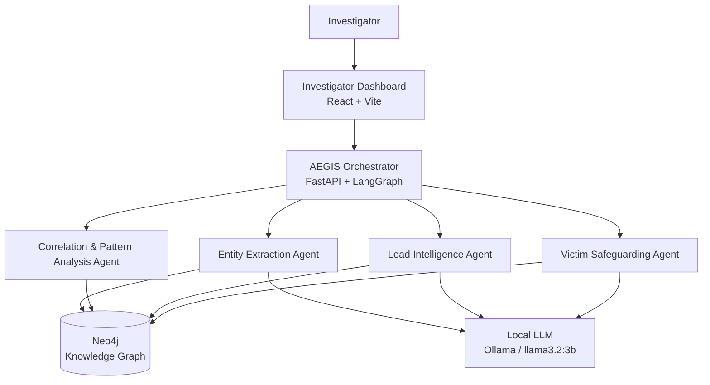
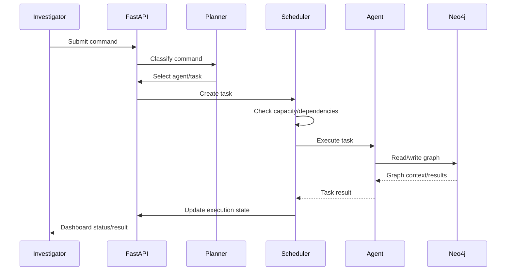
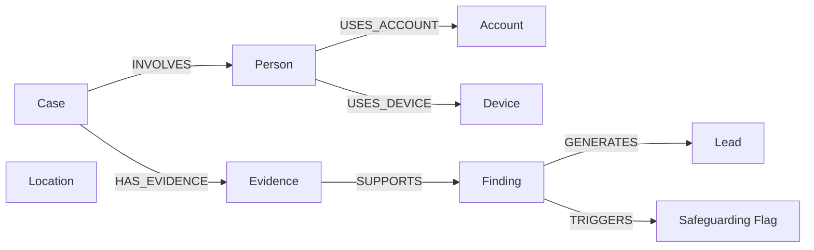

# AEGIS — AI-Enabled Evidence & Graph Intelligence System

> **AI-assisted investigation intelligence for child-protection investigations**

AEGIS is a proof-of-concept investigation platform built around a multi-agent architecture, a shared Neo4j Knowledge Graph, and a LangGraph-based orchestration layer. It helps investigators move from extracted digital evidence to structured entities, cross-case patterns, investigative leads, and victim-safeguarding review signals — while keeping the human investigator in control.

---

## Architecture



### Architectural principle

AEGIS does **not** require a rigid:

```text
Agent 1 → Agent 2 → Agent 3 → Agent 4
```

pipeline.

Instead, specialized agents are independently scheduled by the Orchestrator and operate over shared Knowledge Graph context:

```text
                    Orchestrator
                         │
             ┌───────────┼───────────┐
             ▼           ▼           ▼
        Entity Agent  Correlation  Lead Agent
             │           │           │
             └───────────┼───────────┘
                         ▼
                    Shared Neo4j
                         ▲
                         │
                 Safeguarding Agent
```

This allows independent tasks to execute concurrently when capacity permits.

---

# Problem

Digital investigations can produce large volumes of heterogeneous evidence: chat exports, device metadata, accounts, locations, images, and other extracted artifacts.

The challenge is not only extracting evidence. Investigators also need to:

- identify entities,
- connect evidence,
- discover cross-case patterns,
- prioritize actionable leads,
- recognize potential safeguarding concerns.

AEGIS addresses this analysis bottleneck as an intelligence layer over extracted evidence.

```text
Digital Evidence
      ↓
Forensic Extraction
      ↓
Large Volume of Artifacts
      ↓
Manual Analysis
      ├── Entity identification
      ├── Cross-reference
      ├── Pattern discovery
      ├── Lead generation
      └── Safeguarding assessment
```

---

# Solution

AEGIS combines:

- **4 specialized AI agents**
- **Shared Neo4j Knowledge Graph**
- **LangGraph orchestration**
- **Task scheduling and execution tracking**
- **Evidence-backed graph correlation**
- **Investigator-facing leads**
- **Victim-safeguarding review signals**
- **Human-in-the-loop decision making**

The platform complements forensic extraction tools rather than replacing them.

---

# Core Components

## Investigator Dashboard

The dashboard has two complementary views.

### Case Workspace

A case-centric view containing:

- Case information
- Evidence
- Entities
- Relationships
- Correlation findings
- Investigative leads
- Safeguarding flags
- Investigation history

### Agent Status

An agent-centric operational view containing:

- Active tasks
- Completed tasks
- Agent execution state
- Task status
- Execution history
- Progress tracking

This separates:

> **What is happening in this case?**

from:

> **What is the AI system doing?**

---

## Orchestrator

The Orchestrator is the control plane of AEGIS.

Responsibilities:

1. Accept investigator commands
2. Determine the required agent/task
3. Create executable tasks
4. Manage task state
5. Schedule available tasks
6. Respect agent capacity
7. Execute tasks through LangGraph
8. Track execution history
9. Handle eligible retries

### Task lifecycle

```text
CREATED
   ↓
WAITING
   ↓
READY
   ↓
RUNNING
  /   \
 ↓     ↓
COMPLETED   FAILED
              ↓
            RETRY
```

The PoC also supports states such as `HUMAN_REVIEW` and `BLOCKED`.

---

# Agent Architecture

## 1. Entity Extraction Agent

### Purpose

Convert unstructured evidence into structured investigation entities.

Current categories:

- Person
- Account
- Device
- Location

```text
Raw Evidence
     ↓
Entity Extraction Agent
     ↓
Local LLM
     ↓
Structured Entities
     ↓
Neo4j
```

Example:

```text
Account: John_Doe
Device: Device-004
Device: Device-005
Account: alpha_synthetic
Location: Location-Y
```

---

## 2. Correlation & Pattern Analysis Agent

### Purpose

Identify relationships and repeated entities across the Knowledge Graph.

Examples:

```text
Shared Account
Shared Device
Shared Location
Cross-case relationships
```

Example:

```text
alpha_synthetic
      │
      ├──── CASE-001
      │
      └──── CASE-005
```

The PoC uses graph-based correlation rather than asking an LLM to invent cross-case relationships.

---

## 3. Lead Intelligence Agent

### Purpose

Convert evidence-backed graph relationships into investigator-facing leads.

```text
Graph Finding
     ↓
Lead Intelligence Agent
     ↓
Investigative Lead
     ├── Priority
     ├── Reason
     ├── Direction
     └── Supporting context
```

Example:

```text
[HIGH]
alpha_synthetic

Reason:
The same account appears across multiple independent case records.

Direction:
Review account activity and associated devices across the linked cases.
```

Confidence/priority values are **AI assessment or prioritization signals**, not probabilities of guilt or truth.

---

## 4. Victim Safeguarding Agent

### Purpose

Identify patterns that may warrant safeguarding review.

Example signals:

```text
Potential circulation
Repeated device
Shared account
Repeated cross-case exposure
```

Example:

```text
[HIGH] POTENTIAL_CIRCULATION

Subject:
beta_synthetic

Reason:
Account appears across multiple investigative cases.

Action:
Review linked evidence and assess whether safeguarding
measures are required.
```

These are review signals, not autonomous safeguarding decisions.

---

# Orchestration Model



### Parallel execution

```text
                  Orchestrator
                       │
          ┌────────────┼────────────┐
          ▼            ▼            ▼
     Correlation     Lead       Safeguarding
       Task          Task          Task
          │            │            │
          └────────────┼────────────┘
                       ▼
                  Shared Neo4j
```

Current PoC agent capacities:

| Agent | Capacity |
|---|---:|
| Entity Extraction | 2 |
| Correlation | 2 |
| Lead Intelligence | 2 |
| Victim Safeguarding | 1 |

---

# Knowledge Graph

Neo4j acts as the shared investigation context.



The schema can evolve as the PoC expands. The important architectural role of Neo4j is that it provides a shared, queryable context layer for the independent agents.

---

# Investigation Flow

```text
Evidence
   ↓
Entity Extraction
   ↓
Knowledge Graph
   ↓
Graph Correlation
   ↓
Evidence-backed Findings
   ├───────────────┐
   ↓               ↓
Lead Intelligence  Victim Safeguarding
   ↓               ↓
Investigative Leads Review Flags
   └───────┬───────┘
           ↓
   Investigator Review
```

---

# Demo Workflow

The PoC uses synthetic investigations.

A representative demo case is:

```text
CASE-005
Digital Investigation John Doe
```

Example raw evidence:

```text
John_Doe
   ├── Device-004
   └── Device-005

alpha_synthetic
Location-Y
```

This can be correlated with previously loaded synthetic cases:

```text
                 alpha_synthetic
                  /           \
                 /             \
            CASE-001          CASE-005
                                │
                           John_Doe
                                │
                           Device-005
                                │
                           Location-Y
```

The demo therefore shows:

```text
New Case
   ↓
Entity Extraction
   ↓
Knowledge Graph Population
   ↓
Cross-case Correlation
   ↓
Investigative Leads
   ↓
Victim Safeguarding Review
```

---

# Technology Stack

| Layer | Technology |
|---|---|
| Backend | Python |
| API | FastAPI |
| Agent Framework | LangChain |
| Orchestration | LangGraph |
| LLM | Ollama / `llama3.2:3b` |
| Knowledge Graph | Neo4j |
| Graph Query | Cypher |
| Frontend | React + Vite |
| Styling | CSS |
| Data | Synthetic JSON |
| Database | Docker Compose |

---

# Project Structure

```text
aegis/
│
├── app/
│   ├── agents/
│   │   ├── entity_extraction.py
│   │   ├── correlation.py
│   │   ├── lead_intelligence.py
│   │   └── victim_safeguarding.py
│   │
│   ├── orchestrator/
│   │   ├── scheduler.py
│   │   ├── task_store.py
│   │   ├── task_graph.py
│   │   └── router.py
│   │
│   ├── graph/
│   │   ├── neo4j_client.py
│   │   └── queries.py
│   │
│   └── main.py
│
├── data/
│   ├── cases.json
│   ├── evidence.json
│   └── raw_evidence.json
│
├── frontend/
│   └── ...
│
├── docker-compose.yml
├── requirements.txt
├── .env
└── README.md
```

> File names may vary slightly by branch as the PoC evolves.

---

# Setup

## Prerequisites

Install:

- Python 3.10+
- Node.js / npm
- Docker Desktop
- Ollama

## 1. Clone

```bash
git clone <repository-url>
cd aegis
```

## 2. Create Python environment

### Windows

```bash
python -m venv .venv
.venv\Scripts\activate
```

### Linux/macOS

```bash
python -m venv .venv
source .venv/bin/activate
```

## 3. Install dependencies

```bash
pip install -r requirements.txt
```

## 4. Start Neo4j

```bash
docker compose up -d
```

Neo4j Browser:

```text
http://localhost:7474
```

Bolt:

```text
bolt://localhost:7687
```

Demo credentials:

```text
Username: neo4j
Password: aegispassword
```

Change these credentials for any non-demo deployment.

## 5. Start Ollama

```bash
ollama pull llama3.2:3b
```

Make sure Ollama is running.

## 6. Configure environment

Example:

```env
NEO4J_URI=bolt://localhost:7687
NEO4J_USERNAME=neo4j
NEO4J_PASSWORD=aegispassword
```

---

# Running AEGIS

## Backend

```bash
uvicorn app.main:app --reload
```

FastAPI:

```text
http://localhost:8000
```

Swagger/OpenAPI:

```text
http://localhost:8000/docs
```

## Frontend

```bash
cd frontend
npm install
npm run dev
```

Open the Vite URL shown in the terminal.

---

# Example Commands

### Entity extraction

```json
{
  "command": "Run entity extraction for CASE-005",
  "case_id": "CASE-005"
}
```

### Specific evidence

```json
{
  "command": "Run entity extraction on RAW-006",
  "case_id": "CASE-005"
}
```

### Correlation

```json
{
  "command": "Find connections for CASE-005",
  "case_id": "CASE-005"
}
```

### Lead intelligence

```json
{
  "command": "Generate investigative leads for CASE-005",
  "case_id": "CASE-005"
}
```

### Victim safeguarding

```json
{
  "command": "Assess safeguarding signals for CASE-005",
  "case_id": "CASE-005"
}
```

---

# API Overview

| Endpoint | Purpose |
|---|---|
| `POST /orchestrator/command` | Submit an investigator command |
| `GET /orchestrator/tasks` | Retrieve tasks |
| `GET /orchestrator/status` | Retrieve orchestrator/agent status |
| `GET /executions` | Retrieve execution history |
| `GET /cases/{case_id}/overview` | Retrieve case intelligence |
| `POST /orchestrator/tasks/{task_id}/retry` | Retry an eligible task |

The API surface may evolve during development.

---

# Validation & Trust

AEGIS separates graph-derived findings from LLM-assisted interpretation wherever practical.

```text
Raw Evidence
     ↓
Structured Entities
     ↓
Knowledge Graph
     ↓
Graph-based Correlation
     ↓
Evidence-backed Finding
     ↓
LLM-assisted Interpretation
     ↓
Investigator-facing Lead
```

For example:

**Graph-derived fact:**

```text
alpha_synthetic appears in CASE-001 and CASE-005.
```

**LLM-assisted recommendation:**

```text
Review account activity and associated devices
across the linked cases.
```

The recommendation is not itself treated as evidence.

---

# Design Principles

### Human in control

AEGIS assists investigators; it does not autonomously make investigative, legal, or safeguarding decisions.

### Specialized agents

Each agent has a defined responsibility rather than one general-purpose agent doing everything.

### Shared graph context

Agents operate over common structured context in Neo4j.

### Evidence-backed correlation

Relationships should be derived from structured evidence and graph relationships rather than invented by an LLM.

### Modular orchestration

Tasks are independently scheduled, tracked, retried where appropriate, and recorded for execution history.

---

# Current PoC Scope

The proof-of-concept demonstrates:

- Multi-agent architecture
- Entity extraction
- Neo4j Knowledge Graph population
- Cross-case correlation
- Investigative lead generation
- Victim-safeguarding review signals
- LangGraph task execution
- Orchestrator scheduling
- Agent capacity management
- Case-scoped workflows
- Execution tracking
- React investigator dashboard
- Multiple synthetic cases

The architecture has been exercised with newly created synthetic cases rather than depending solely on a single scripted case.

---

# Future Extensions

Potential production extensions include:

- Forensic extraction-tool integration
- Chat/document/image ingestion
- OCR and multimodal evidence analysis
- More entity types
- Temporal graph relationships
- Evidence provenance and traceability
- Stronger evidence/confidence scoring
- Human-review checkpoints
- Role-based access control
- Audit logging
- Encryption
- Case isolation
- Persistent distributed task queues
- Scalable inference
- Monitoring and observability

---

# Disclaimer

AEGIS is a **proof-of-concept research/demo system**.

All investigation data in this repository is synthetic. The system is not intended to make autonomous investigative, legal, or safeguarding decisions.

A real-world deployment would require appropriate security, privacy, evidence-provenance, access-control, auditability, human-oversight, legal, and operational controls.

---

## AEGIS

**AI-Enabled Evidence & Graph Intelligence System**

> Turning extracted evidence into connected investigative intelligence — while keeping the investigator in control.
